  
  

   
  

<h2>Hello World, I'm ChenJunJie! </h2>

      

 <   

 

|  |  |  |
|:--:| :--: |:--: |
| *No control* | *Swing-Up without Stabilization* |  *Swing-Up with Stabilization* |

<!-- About me image -->

<h3> 👨🏻‍💻 &nbsp;About Me  </h3>

- 🎓 I am a Accounting Computer science and technology  major and currently studying  communication engineering, Coding  and mathematics! 🐺
- 🤔 &nbsp; Exploring new technologies and developing software solutions and quick hacks.
- 💼 &nbsp; Passionate Programmer, Matlab Developer, problem solving Skills and a Competitive Programmer.
- 🌱 &nbsp; Learning more about Web Development, Database Management System, SQL and Familier with Data Science & ML.
- ✍️ &nbsp; Participation on Different Levels Innovation Cell Projects, etc.
- 📫 How to reach me: wandrys.sousa@protonmail.com ⚛️
- ⚡ Fun fact: I love listening to music and playing the guitar! 🎸

## Like My Work? : 

</a

<h3> 🛠 &nbsp;Tech Stack</h3>

- 💻 &nbsp;
  
  + C/C++
  + Python
  + ShellScript
  + Markdown
  + Matlab
  
  

 

<h3> 🤝🏻 &nbsp;Connect with Me  </h3>

## Social

## 🌐 Connect with me:

## 📈 My GitHub Stats 

          
    

        
    

### 🏆 Trophies

### 📊 Overall Stats

<table width="100%"> 
  <tr>
    <td width="40%">
      
    </td>
    <td width="30%">
      
    </td>
    <td width="30%">
      
    </td>
  </tr>
</table>

 
  Visitors : 
  

  

